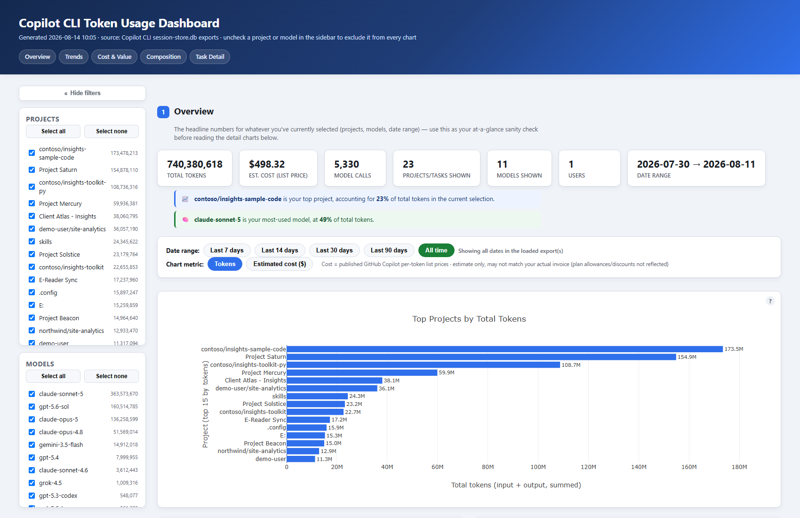
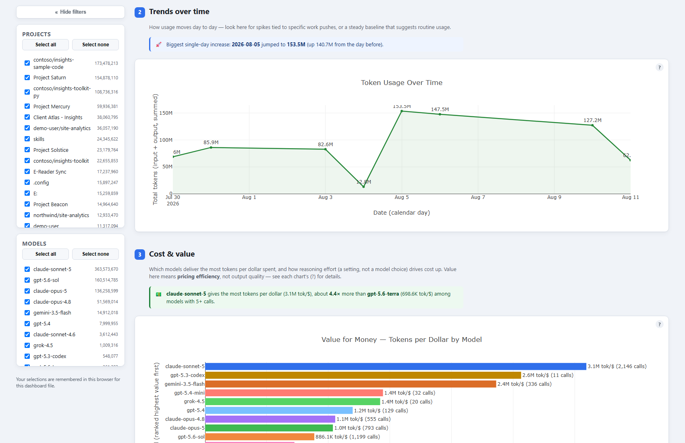
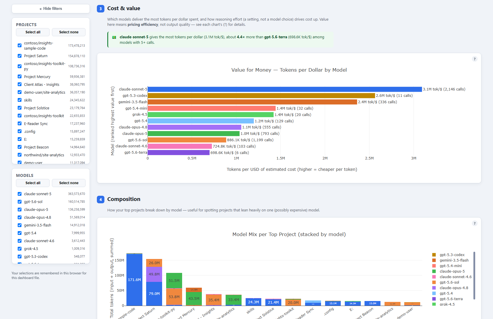
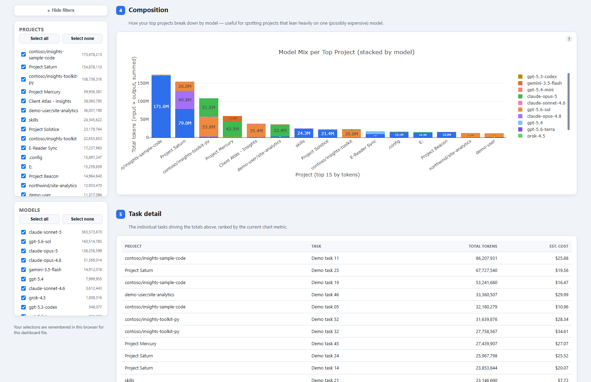
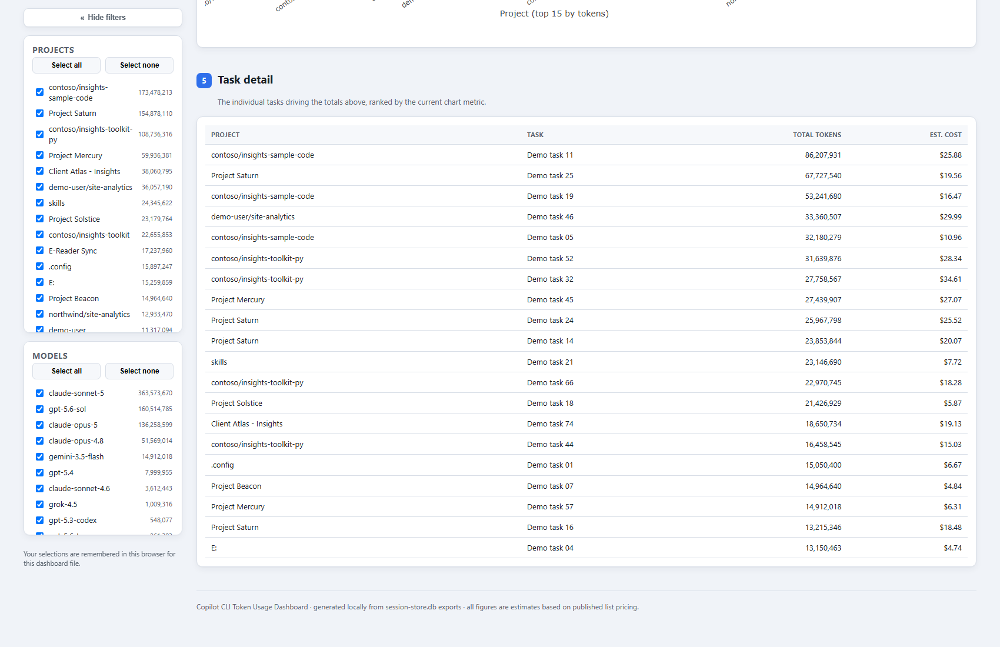

# Copilot CLI Token Usage Dashboard

Find out which projects/tasks consume the most GitHub Copilot CLI tokens
(and dollars), and which models drive that spend — using data that already
exists on your machine. No new logging, no org API access, no backend
required.

**Primary use case: your own local usage.** Run both scripts on your own
machine to see your own numbers — no sharing, no team folder, no exposure
of anything beyond what already lives in your local `session-store.db`.
The multi-user "team rollup" workflow described later in this README also
works (the scripts and de-duplication logic already support it), but it is
a secondary scenario, and one you should think through before using: see
**Privacy notes on the generated HTML** below.

Output is a single self-contained HTML file (Plotly, JS embedded inline) —
open it by double-click in any browser, fully offline.



## Dashboard sections

The preview above shows **Overview**. The remaining sections provide focused
views of usage trends, pricing efficiency, model composition, and task detail.
These documentation screenshots use synthetic project and task names; the
displayed figures are representative.

<table>
  <tr>
    <td><strong>Trends over time</strong><br></td>
    <td><strong>Cost &amp; value</strong><br></td>
  </tr>
  <tr>
    <td><strong>Composition</strong><br></td>
    <td><strong>Task detail</strong><br></td>
  </tr>
</table>

## ⚠️ Who this is for (read before sharing widely)

This works for **GitHub Copilot CLI users only** — not GitHub Copilot in
general. Specifically:

| Works with | Does NOT work with |
|---|---|
| GitHub Copilot **CLI** (this terminal agent) | Copilot in VS Code / JetBrains / Visual Studio (IDE completions & chat) |
| | Copilot Chat on github.com |
| | Copilot coding agent (background/PR agent) |
| | Copilot mobile |

If a teammate has never run the `copilot` CLI, `~/.copilot/session-store.db`
won't exist and there's nothing to extract. This tool only sees usage from
the CLI, on whichever machine(s) you run the export on — if you use the CLI
on more than one device, each device needs its own export merged in for a
complete picture.

## Requirements & limitations

- **Python 3.9+** and `pip install -r requirements.txt` (pandas, plotly).
- **Read access to `~/.copilot/session-store.db`** — created automatically
  by Copilot CLI the first time it's used.
- **Relies on an internal, undocumented local database schema**, not a
  published/stable public API. It was reverse-engineered from one
  installation (Copilot CLI **v1.0.79**, Windows) and validated against
  ~5,300 usage rows spanning that install's full history — there is
  **no guarantee this schema is stable across CLI versions**, and a future
  update could silently change or remove fields this tool depends on
  (`assistant_usage_events`, `total_nano_aiu`, etc.). `extract_usage.py`
  validates that the required tables/columns exist before querying and
  exits with a concise `ERROR:` message naming exactly what's missing if
  they don't (instead of a raw `sqlite3` traceback), but it can only detect
  *absence* — a schema change that silently repurposes an existing
  column's meaning wouldn't be caught. Treat this as a best-effort
  community tool, not an officially supported one.
- **macOS/Linux are untested** — the code is written to be portable
  (standard `~/.copilot` path, plain SQLite), but has only actually been
  run on Windows so far.
- **Cost estimates depend on `total_nano_aiu` being populated per row.**
  On the one install tested, coverage was 100%, but this hasn't been
  verified against older CLI versions, and any gap would silently
  *understate* cost with no warning shown in the dashboard.
- **Org/enterprise telemetry policies are unverified.** If an organization
  disables local usage logging, `session-store.db` may be missing or
  empty — this tool has no way to detect or flag that; it will just look
  like zero usage.
- **Requires comfort running Python from a terminal.** For non-technical
  stakeholders, someone technical will likely need to run the export step
  on their behalf, or you'll need to package it further (e.g. a scheduled
  task producing the CSV automatically).
- Multiple Windows/GitHub accounts on a shared machine will be pooled
  together unless each account exports separately with a distinct
  `--user-label`.

## How it works

1. **`extract_usage.py`** reads `~/.copilot/session-store.db` through a
   read-only, point-in-time snapshot (see below) and writes a
   privacy-reduced CSV: one row per session/model/day/reasoning-effort, with
   token and cost totals. Local folder paths are reduced to just the repo
   name or last folder name, so exports don't leak your full local directory
   structure. This is **path-minimization, not anonymization** — the CSV
   still contains your username/label, project and model names, and
   (with `--include-task-summary`) free-text task summaries; review its
   contents before sharing it anywhere.
   - **Temporary snapshot handling:** rather than copying the DB file (plus
     its `-wal`/`-shm` sidecars) directly — which can produce a torn,
     inconsistent copy if Copilot CLI is writing to it at the same time —
     `extract_usage.py` uses SQLite's online backup API to take a single,
     transactionally-consistent snapshot into a temporary file, opened
     read-only, and never locks or writes to the live database. The
     temporary snapshot (and its directory) is always deleted afterward,
     both on success and if extraction fails partway through.
   - **Schema validation:** before querying, the required tables/columns are
     checked; if the local `session-store.db` doesn't match what this
     script expects (e.g. an incompatible Copilot CLI version), it exits
     with an `ERROR:` message naming the missing table(s)/column(s) instead
     of a raw SQLite exception.
2. **`dashboard.py`** reads one or many of those CSVs and renders the HTML
   dashboard: top projects/tasks, model mix, cost trend, reasoning-effort
   breakdown — with live Project/Model checkbox filters and a Tokens ↔ Cost
   toggle. Each `extract_usage.py` export contains a user's **full** history
   (not just what's new since the last run), so re-exporting weekly and
   globbing all `copilot_usage_*.csv` files is expected to produce
   overlapping rows across files — `dashboard.py` automatically de-duplicates
   on (user, session_id, date, model, reasoning_effort), keeping the most
   recently exported copy of each row, so old exports are safe to leave in
   place.
   - **Input validation:** each CSV is checked before use. Required columns
     — `user`, `date`, `project`, `model`, `calls`, `total_tokens` — must be
     present or the file is rejected with an `ERROR:` naming the file and
     the missing column(s). Older exports missing optional columns
     (`session_id`, `reasoning_effort`, `total_nano_aiu`) are still
     accepted; each missing optional column is back-filled with a
     documented default (`None`, `"n/a"`, `0.0` respectively) rather than
     raising. `calls`, `total_tokens`, and `total_nano_aiu` (when present)
     must be finite, non-negative numbers, and `date` must parse as a
     valid date — invalid values are rejected with an `ERROR:` naming the
     file, column, and CSV row number(s), rather than being silently
     coerced to a misleading `0`.

## Privacy notes on the generated HTML

- **Browser display filters (reversible, not privacy-safe for sharing).**
  The Project/Model checkboxes and the `--exclude-default` /
  `--exclude-default-models` flags only control what's **visually shown**
  in the browser. They do **not** remove any row from the generated HTML
  file — every project, model, date, and (if included) task summary from
  the input CSV(s) is embedded in the file's data and is recoverable by
  anyone who opens the file's source (e.g. "View Page Source" or a text
  editor), even for items you've unchecked or excluded by default. Do
  **not** rely on these for sharing a dashboard with someone who shouldn't
  see certain projects.
- **Build-time exclusion (irreversible, use this for sharing).** Two flags
  actually drop data before the HTML file is written, so excluded content
  is never embedded and cannot be recovered from the shared file:
  - `--exclude-project PROJECT` (repeatable) removes every row for an
    **exact** project name. Use it once per project — repeat the flag for
    more than one, which also avoids any ambiguity with project names that
    contain commas:
    ```powershell
    python dashboard.py --in "copilot_usage_*.csv" --out shared_dashboard.html `
      --exclude-project "Personal Side Project" `
      --exclude-project "Client A, Confidential"
    ```
  - `--omit-task-summaries` strips the free-text `task_summary` column
    entirely before build, so no task-summary text (from any project) is
    embedded. Work Patterns and Task Detail then correctly show their
    existing "no task summaries available" state.
  - Both apply before project/model orders, totals, the embedded RAW JSON,
    the Project/Model checkboxes, and every insight callout are computed —
    and an excluded project is also purged from `--exclude-default`'s
    embedded default list, so it can't reappear there either. Console
    output reports exactly how many rows/projects were removed, warns if
    an `--exclude-project` name matched nothing (rather than silently
    implying redaction happened), and exits with an error instead of
    writing a broken/empty dashboard if exclusion would remove every row.
  - **Example — sharing your own individual dashboard** while holding back
    a couple of personal/confidential projects and any free-text task
    detail:
    ```powershell
    python dashboard.py --in "copilot_usage_martinchan_*.csv" --out martinchan_shareable.html `
      --exclude-project "Home Automation" --exclude-project "Job Search 2026" `
      --omit-task-summaries
    ```
  - **This is not anonymization.** `--exclude-project` and
    `--omit-task-summaries` only remove the specific project names / task
    text you name. Every other field is retained and still identifies the
    export as yours, including: the `user` label baked into the CSV by
    `extract_usage.py --user-label` (or your machine username by default),
    `session_id` values, and the names of every **non-excluded** project,
    model, date, and (unless `--omit-task-summaries` is used) task summary.
    Review the underlying CSV(s) yourself before sharing if you need
    anything beyond exact project-name/task-summary redaction.
- All data-derived text (project/model names, task summaries, the
  dashboard title) is HTML/JS-escaped when the file is generated, so it
  can't inject scripts or break the page - but escaping controls how the
  data is *rendered*, not whether it's *present*. For anything
  `--exclude-project` / `--omit-task-summaries` don't cover (e.g. dropping
  a specific date range, a specific model, or a specific user in a
  team-wide export), filter your input CSV(s) before running
  `dashboard.py`.
- If you share a generated dashboard, treat it the same as you'd treat the
  source CSV(s) it was built from.
- **Spreadsheet formula injection.** The dashboard's "Copy table" button
  (Task detail section) neutralizes cell text that would otherwise be
  interpreted as an active formula/DDE command if pasted into Excel/Sheets
  (values starting with `=`, `+`, `-`, or `@` are prefixed with a leading
  `'`, and embedded tabs/newlines are flattened so a single field can't
  inject extra rows/columns). **The raw CSV files produced by
  `extract_usage.py` are not similarly neutralized** — if a project name or
  task summary happens to start with one of those characters and the CSV
  is opened directly in a spreadsheet application (rather than through
  `dashboard.py`), that cell could be interpreted as a formula. This is not
  mitigated in this release because doing so would require prefixing the
  `project` field itself, which is also used as an identifier for matching
  and de-duplication elsewhere in this tool, and changing its stored value
  is a format decision that deserves its own change/testing pass rather
  than a drive-by fix here. If you open exported CSVs directly in Excel,
  be aware of this risk, or import them as plain text.

## Quick start

```powershell
git clone https://github.com/microsoft/ghc-cli-dashboard.git
cd ghc-cli-dashboard
pip install -r requirements.txt

# 1. Export your usage (run anytime, e.g. weekly)
python extract_usage.py --include-task-summary

# 2. Build your personal dashboard
python dashboard.py --in "copilot_usage_*.csv" --out usage_dashboard.html

# 3. Open usage_dashboard.html in any browser
```

## Features

### Estimated cost ($)

Click **Estimated cost ($)** above the charts to switch every chart (and the
top-tasks table) from raw tokens to a real-dollar cost estimate, computed
per usage row as:

```
estimated_cost_usd = total_nano_aiu / 1e11
```

(1 AI credit = $0.01; `total_nano_aiu`'s underlying batch pricing was
verified against GitHub's published per-token rates — see
[Models and pricing for GitHub Copilot](https://docs.github.com/en/copilot/reference/copilot-billing/models-and-pricing) —
and matches exactly for input/cached-input/cache-write/output across
several models.)

**Caveat:** this is a *list-price estimate*, not necessarily your literal
invoice line — it doesn't account for included plan allowances, enterprise
discounts, or currency differences. Use it for relative comparison (which
project/model costs more), not as an exact bill.

### Project & model filters

Two independent checklists in the sidebar — **Projects** and **Models** —
each with Select all/Select none. Unchecking an item instantly excludes it
from every chart and KPI. Each selection is saved in the browser's
`localStorage` per dashboard file, so your choice persists next time you
reopen it. Seed default exclusions (e.g. for personal projects you never
want shown by default) with:

```powershell
python dashboard.py --in "copilot_usage_*.csv" `
  --exclude-default "Project Alpha,Project Beta,Weekend Planning" `
  --exclude-default-models "gemini-3.5-flash"
```

(Only affects first load — once you toggle checkboxes yourself, your
browser's choice wins. See **Privacy notes on the generated HTML** above —
this only hides rows in the browser; use `--exclude-project` /
`--omit-task-summaries` to actually remove data before sharing a file.)

### Collapsible filter panel

The Projects and Models filter sidebar can be collapsed with **Hide filters**
to give the charts more room. Its state is remembered in the browser alongside
the other dashboard selections.

### Task detail table

The Task detail section includes a client-side search across project and task
names, clickable sorting for every column, and a **Copy table** button that
copies the currently displayed top 20 rows as tab-separated text for pasting
into Excel, Teams, or an email.

### Reasoning effort mix

A chart breaks down tokens/cost by `reasoning_effort`
(`none`/`low`/`medium`/`high`) — a direct cost lever, since `high`-effort
calls burn substantially more reasoning tokens per call.

### On-chart data labels

Every chart shows compact value labels directly on it (e.g. `"154.9M"`,
`"$108.22"`) — no hovering required to read values. Hover still shows exact,
non-rounded figures.

### Explicit axis titles & hover-over explanations

Every chart has a descriptive value/category axis title (e.g. *"Total
tokens (input + output, summed)"*, *"Project (top 15 by tokens)"*) so the
unit is never ambiguous at a glance. Each chart card also has a small `?`
icon — hover it for a plain-English explanation of what the chart shows and
how to read it. KPI cards and the Date range/Chart metric labels have
hover tooltips too.

### Date range quick filters

Buttons above the charts — **Last 7 / 14 / 30 / 90 days** or **All time**
(default) — filter every chart, KPI, and the Top Tasks table to a rolling
window. "Last N days" is computed relative to the **most recent date in
your loaded CSV(s)**, not today's real-world date (the export may be a few
days old), and a hint next to the buttons always states the exact date
range currently shown. Your choice persists per-browser like the
project/model filters.

### Trend aggregation

The Trends over time chart can be grouped by **Day**, **Week**, or **Month**.
Weekly buckets start on Monday, and monthly buckets use calendar months. The
selected grouping is remembered in the browser for that dashboard file.

### Work patterns

When task summaries are included, the Work patterns section applies transparent
keyword rules to infer themes such as **Explore & learn**, **Analyze & decide**,
**Plan & organize**, **Build & implement**, and **Review & communicate**. It
shows theme mix over time, theme by model, and an exploration/execution-style
work-mode balance. These are inferred workflow signals, not productivity or
performance measures.

### Value for Money — tokens per dollar by model

A dedicated chart ranks models by `total_tokens ÷ estimated_cost` (tokens
bought per dollar of list-price spend), highest first, with the call count
shown per bar so you can judge how much data backs each ranking. This is a
**pricing-efficiency ratio only** — it does not measure output quality,
accuracy, or how many tokens a model actually needs to do a task well, and
a model used mostly at high reasoning-effort will look worse here even if
its answers are better (reasoning tokens cost more). An auto-generated
callout names the best/worst-value model (restricted to models with 5+
calls, to avoid noise from one-off usage).

### Narrative layout & design

The dashboard is organized into five numbered, sequential sections with a
top navigation (**Overview → Trends → Cost & Value → Composition → Task
Detail**), each with a short blurb explaining what it answers. Charts that
break down by model (pie, stacked bar, value-for-money) share one
consistent colour-per-model palette, so a given model is recognizable
across charts without re-reading legends. Auto-generated insight callouts
(e.g. top project's % share, biggest single-day usage jump, best-value
model) surface the headline takeaway of each section in plain language,
so someone skimming doesn't have to interpret raw charts unassisted.

## Scaling to a team

- **Personal (primary scenario)**: run both scripts on your own machine to
  see your own usage — nothing leaves your machine.
- **Team-wide rollup** — no backend needed, but read
  **Privacy notes on the generated HTML** above first, since the resulting
  file embeds every row from every teammate's CSV, and checkbox/default
  filters only hide rows visually:
  1. Everyone runs `extract_usage.py` and drops the CSV into a shared
     Teams/SharePoint/OneDrive folder (optionally on a schedule, e.g. a
     weekly Windows Task Scheduler job).
     ```powershell
     python extract_usage.py --user-label "jsmith" --out "\\team\share\copilot_usage_jsmith_YYYY-MM-DD.csv"
     ```
  2. Anyone points `dashboard.py` at the shared folder to get one combined
     dashboard across the whole team (adds a Users chart automatically when
     more than one user is present):
     ```powershell
     python dashboard.py --in "\\team\share\copilot_usage_*.csv" --out team_usage_dashboard.html
     ```

## Repository and generated files

The project is maintained in the GitHub repository
[`microsoft/ghc-cli-dashboard`](https://github.com/microsoft/ghc-cli-dashboard).
Generated CSV and HTML outputs are excluded by `.gitignore` because they can
contain personal usage data, project names, and optional task summaries. The
repository's preview image uses synthetic project names; its displayed
figures are representative dashboard data.

## Notes / caveats

- See **Requirements & limitations** above for scope/version/platform
  caveats. This section covers privacy and cost-accuracy notes only.
- If GitHub Enterprise admin-level Copilot usage metrics are needed instead
  of this per-machine tool, that's a separate, admin-only data source this
  project doesn't use or have access to.
- `--include-task-summary` includes the free-text session/task summary
  (e.g. "Develop Token Usage Dashboard"). Leave it off for wider/less
  trusted sharing, since summaries can contain sensitive task detail.
- Cost figures are list-price estimates derived from token counts — see
  the Estimated cost section above for the caveat on accuracy.

## Running tests

A small pytest suite in `tests/` guards the security-sensitive parts of
`dashboard.py` — HTML/JS escaping of project/model names, the dashboard
title, and the task-detail table's `</script>`-safe JSON embedding, plus
formula-injection neutralization in the "Copy table" TSV clipboard text —
and the build-time redaction flags (`--exclude-project`,
`--omit-task-summaries`), including hostile/unusual project names,
`--exclude-default` overlap, unmatched-exclusion warnings, and the
all-rows-excluded error.

```powershell
pip install -r requirements.txt -r requirements-dev.txt
python -m pytest tests/ -v
```

A few tests execute the generated dashboard's inline JavaScript in a
lightweight fake-DOM harness (`tests/dom_harness.js`) via Node.js to verify
runtime behavior end-to-end; those are skipped automatically if `node` isn't
on `PATH`.

## Maintainer note: Plotly title syntax

`dashboard.py` bundles **Plotly.js v3.7.0** (via `plotly.offline.get_plotlyjs()`).
That version requires every `title` — chart title and axis titles — to be
an **object**, e.g. `title: { text: "..." }`, not the plain-string shorthand
(`title: "..."`) that older Plotly versions auto-converted. Passing a plain
string silently renders no title at all (no error). If you add a new chart
or edit an existing title, use the object form.
